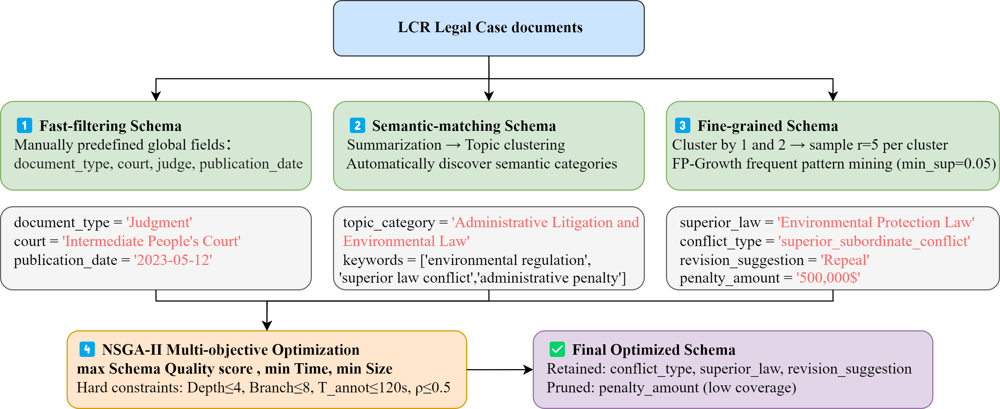
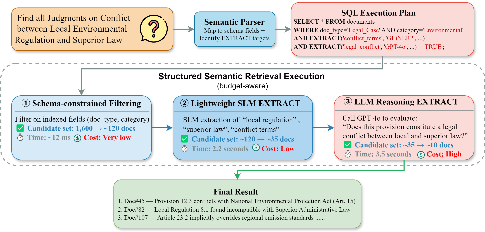

# AnnoRetrieve

AnnoRetrieve is an innovative system that integrates automated document annotation schema generation and structured semantic retrieval, designed to enhance the efficiency and accuracy of document retrieval.

## Core Innovations

### SchemaBoot
Automatically generates document annotation schemas through multi-granularity pattern discovery and constraint-based optimization, laying the foundation for annotation-based retrieval and eliminating the need for manual schema design.

  

### Structured Semantic Retrieval (SSR)
The core retrieval engine that combines semantic understanding with structured query execution. By leveraging annotation structures instead of vector embeddings, SSR achieves precise semantic matching, seamlessly completing attribute value extraction, table generation, and step-by-step SQL-based reasoning without frequent reliance on large language model interventions.

  

